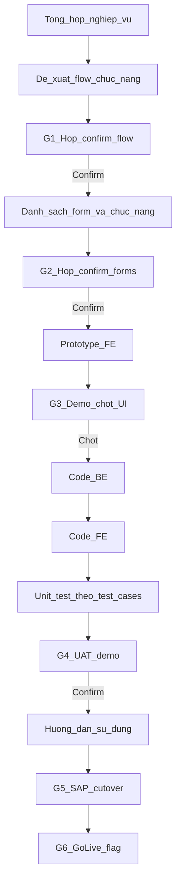
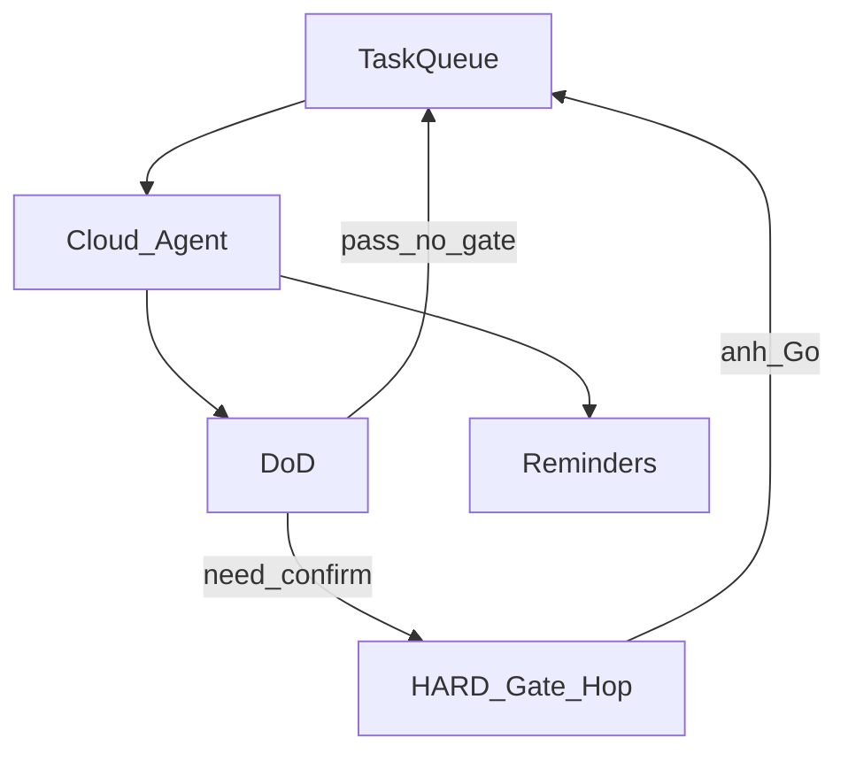
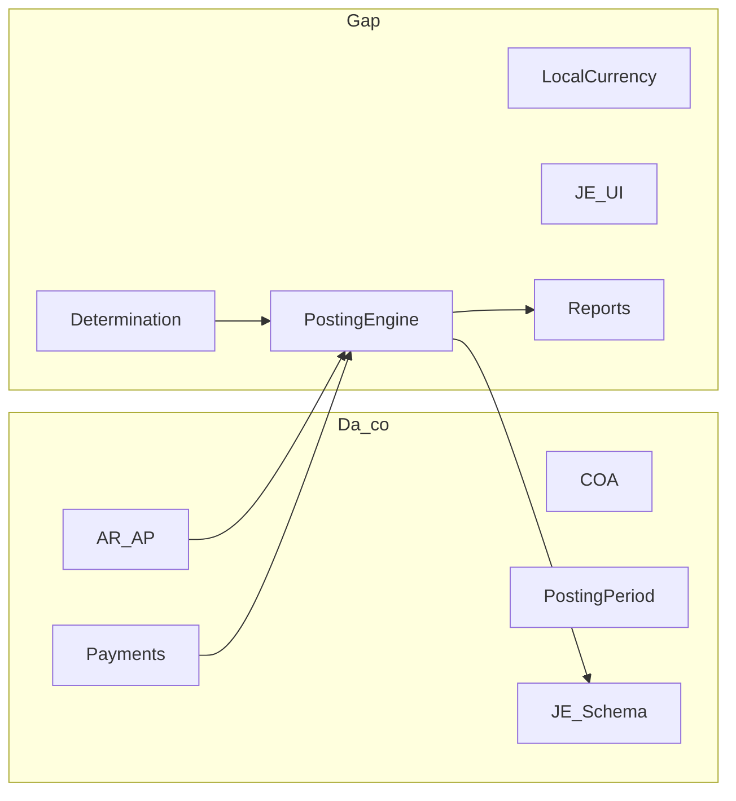
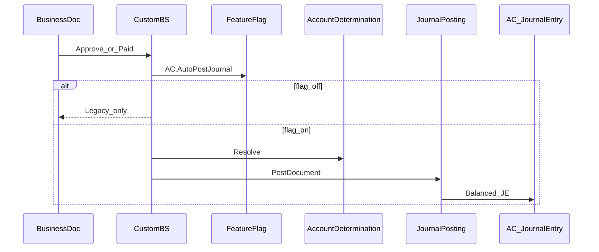

# Module Kế toán ART-ERP — Plan (canonical)

**Path:** [`.cursor/plans/AC/plan.md`](plan.md)  
**Khi execute:** `task-queue.json`, `gates/G#.md`, `docs/` cạnh file này.  
**Reminders:** mirror list `ART-AC Accounting` — anh chỉ xem; em tự sync.

---

## 0. Vòng giao tiếp bắt buộc với anh (Nhà tài trợ)

Em **phải xin họp / trao đổi confirm** ở từng bước dưới đây. **Không** sang bước sau khi chưa có confirm (Go / Adjust). Không “default bỏ qua” các gate HARD.



| Bước | Em làm (chủ động) | Em xin anh | Output sau confirm |
|------|-------------------|------------|-------------------|
| **1. Nghiệp vụ → Flow** | Tổng hợp as-is ART + tham chiếu SAP B1; đề xuất flow & chức năng MVP | **G1 họp confirm** | Flow đã chốt (docs draft) |
| **2. Forms** | Phân tích → danh sách forms + chức năng từng form + draft test cases | **G2 họp confirm** | Spec forms + test cases baseline |
| **3. Prototype FE** | Làm prototype UI (route/stub/mock, pattern ART) | **G3 demo → chốt UI** | Prototype approved |
| **4. Code** | BE → FE gắn API → unit/integration test theo test cases G2 | (cập nhật Reminders; không họp trừ blocker) | Build staging sẵn UAT |
| **5. UAT** | Demo end-to-end staging | **G4 UAT confirm** | Nghiệp vụ đạt |
| **6. Hướng dẫn** | Viết Hướng dẫn sử dụng (+ hoàn thiện Flow/Forms/Test đã confirm) | Anh nhận docs | DOCS đủ |
| **7. Cutover / Go-live** | SAP dry-run; checklist flag | **G5** ký cutover; **G6** lệnh bật flag | Prod an toàn |

### Cách xin họp (mỗi gate HARD)

1. Em gửi trước ≥1 ngày: agenda 5 dòng + tài liệu/demo link + câu hỏi đóng (A/B).  
2. Reminder `[AC][G#]` priority high — note “Chờ họp confirm”.  
3. **HARD STOP** task phụ thuộc gate đó; em chỉ làm việc song song không phụ thuộc (vd. chuẩn bị scaffold nhánh, không commit UI chưa chốt).  
4. Biên bản `.cursor/plans/AC/gates/G#.md` sau họp: Go / Adjust / Defer + answers.  
5. Adjust → em sửa deliverable → xin họp lại cùng gate.

**Biên bản mẫu:**

```
Gate: G#
Date / attendees:
Sponsor decision: Go / Adjust / Defer
Answers:
Changes requested:
Next step unlocked:
```

---

## 1. Quyết định kỹ thuật đã chốt (có thể chỉnh ở G1)

| Quyết định | Default (chờ G1 confirm) |
|------------|--------------------------|
| Tiền tệ | Local + Foreign; MVP SC ≡ LC |
| MVP posting | AR Approved / AP Posted / Payment Paid + Manual JE; Inventory = Phase 2 |
| SAP cutover | Masters + OB TB + Open AR/AP; không sync realtime MVP |
| Production | Feature flag; flag off = hành vi hiện tại 100% |
| Docs giao anh | Flow, Forms, Chức năng form, Test cases (trước/ trong gates); **Hướng dẫn sử dụng sau UAT** |

---

## 2. Autopilot + HARD gate



- Em chủ động làm hết trong phạm vi đã unlock.  
- Gặp gate HARD → **xin họp**, cập nhật Reminders, dừng nhánh phụ thuộc.  
- Reminders = mirror; anh không cần tick để em làm.

Thứ tự unlock: `bootstrap` → BA flow → **G1** → BA forms → **G2** → Prototype → **G3** → BE → FE → Test → **G4** → Hướng dẫn → SAP → **G5** → **G6**.

---

## 3. Production safety

| Loại | Cách |
|------|------|
| P0 form/report mới, prototype | Feature branch |
| P1 hook approve/pay/receive | `AC.AutoPostJournal=false` mặc định |
| P2 schema | Additive only |
| P3 SAP import | Staging → G5 → cutover |

Flag off không đụng e-invoice / POS / gateway. Rollback = tắt flag.

---

## 4. Deliverables theo từng gate (chi tiết)

### G1 — Confirm flow & chức năng

**Em mang:**  
- Tóm tắt nghiệp vụ kế toán (ART as-is vs SAP B1).  
- Sơ đồ flow đề xuất (AR/AP/Payment/JE/Period/Config LC).  
- Danh sách chức năng MVP vs Phase 2.  
- Rủi ro production / feature flag.

**Anh confirm:** Scope MVP, thời điểm post JE, LC, có/không Inventory trong MVP, cutover mang open invoice.

**Docs ghi:** `docs/02-flow-xu-ly.md` (draft → chốt sau G1).

### G2 — Confirm forms & chức năng trong form

**Em mang:**  
- `docs/03-danh-sach-forms.md` — form code, route, mới/cũ, quyền.  
- `docs/04-chuc-nang-trong-form.md` — field, nút, rule từng form.  
- `docs/05-test-cases.md` — draft matrix (dùng cho unit test + UAT).

**Anh confirm:** Đủ/thiếu form; đổi tên/menu; bỏ/thêm chức năng.

**Không** bắt đầu prototype ngoài wireframe thô trước Go G2.

### G3 — Demo prototype FE → chốt UI

**Em mang:** Prototype chạy được (Ionic pages stub / mock data), đúng pattern `PageBase`, menu tạm hoặc deep-link.  
**Demo script:** các màn đã liệt kê G2 (JE, settings LC, tab Accounting, reports stub…).  
**Anh chốt:** Layout, field hiển thị, thao tác chính.

**Sau Go:** mới code BE đầy đủ + FE gắn API theo prototype.

### G4 — UAT demo

**Em mang:** Staging + cờ on (chỉ staging); kịch bản từ test cases G2; so 1–2 bút toán mẫu SAP nếu anh cung cấp.  
**Anh confirm:** Đạt / list defect.  
**Sau Go:** viết `docs/01-huong-dan-su-dung.md`.

### G5 / G6 — Cutover & go-live

Như mục 8–9 kỹ thuật; bắt buộc lệnh anh.

---

## 5. Packages kỹ thuật (sau khi G3 chốt)

Thực hiện theo thứ tự unlock; chi tiết vẫn theo kiến trúc dưới.

| Package | Nội dung | Unlock sau |
|---------|----------|------------|
| BA-1 | Nghiệp vụ + flow đề xuất | bootstrap |
| BA-2 | Forms + chức năng + test cases draft | G1 |
| FE-Proto | Prototype UI | G2 |
| BE-Core | JournalPosting, Determination, Period/LC config, hooks flag-off | G3 |
| FE-Full | Forms thật + API | G3 |
| TEST | Unit/integration + regression | song song FE-Full |
| DOCS-HD | Hướng dẫn sử dụng | G4 |
| SAP-ETL | Dry-run staging | sau G4 / song song HD |
| Phase2 | Inventory GL, CN/DN, CC, Year-end… | sau G6 hoặc backlog |

---

## 6. Đa tiền tệ & gap (input cho G1)

**As-is:** Currency/Rate có; AR/AP/JE có Currency; Payment thiếu Currency header; chưa `AC.LocalCurrency` chính thức.  
**To-be:** LC qua `#/config` segment AC; FC trên chứng từ; JE LC+FC; SC≡LC MVP.



---

## 7. Kiến trúc posting (sau G3, flag on lúc UAT staging)



**Modify (flag):** `BS_AC_ARInvoice`, `BS_AC_APInvoice`, Incoming/Outgoing Payment, (Phase2) WMS Receipt/Shipping.  
**Mới:** `BS_AC_JournalPosting`, `BS_AC_AccountDetermination`, JournalEntry API/UI, reports, AC config keys.

---

## 8. SAP B1 → ART (cutover — G5)

| SAP | ART | MVP |
|-----|-----|-----|
| OACT | FINANCE_GeneralLedger | Masters |
| OCRN/ORTT | Currency/ExchangeRate | Masters |
| OACP/OFPR | PostingPeriod | Masters |
| OJDT | JournalEntry | Chỉ OB JE |
| OINV/OPCH | AR/AP | Open only |
| ORCT/OVPM | Payments | Nếu cần |

Sequence: Freeze → staging masters → dry-run TB → cửa sổ OB+open docs → G6 bật flag.

---

## 9. Forms skeleton (chờ G2 chốt chi tiết)

| Form | Mới/Cũ | Ghi chú |
|------|--------|---------|
| `#/config` AC / accounting-settings | Mới | Local Currency, flags |
| general-ledger, posting-period, tax-definition | Cũ | Siết flags |
| currency, exchange-rate | Cũ | |
| journal-entry | Mới | |
| ar/ap-invoice, incoming/outgoing-payment | Cũ | Tab Accounting; Currency payment |
| account-determination | Mới/extend | |
| trial-balance, GL, BS, P&L, aging, opening-balance | Mới | |
| sap-import | Mới | Staging only |

SAP Setup ↔ `#/config`: Company Details ≈ `#/config`; CoA/Tax/Period/Currency = forms riêng; gap Accounting Data (LC) → Package sau G3.

---

## 10. Reminders mirror

List `ART-AC Accounting`. Prefix `[AC][G1]`…`[AC][G6]`, `[AC][ba-…]`, `[AC][fe-proto]`, `[AC][be-core]`, …  
ORCH complete khi task/gate Done. Gate HARD mở = “Chờ họp anh”. Source of truth = task-queue + `gates/*.md`.

---

## 11. Definition of Done MVP

- Đã qua **G1→G4** với biên bản Go.  
- Prototype đã chốt (G3) khớp FE production.  
- BE/FE + test cases pass; UAT đạt (G4).  
- Có Hướng dẫn sử dụng.  
- Flag off prod an toàn; G6 mới bật theo lệnh anh.  
- Reminders đồng bộ.

---

## 12. Khi anh lệnh execute

1. Bootstrap queue + branch + flags + Reminders.  
2. Chạy **BA nghiệp vụ + đề xuất flow** → **xin họp G1** (không nhảy cóc).  
3. Mỗi gate HARD: em chủ động mời họp + gửi tài liệu trước.  
4. Không bật flag prod / import SAP prod đến G6.
