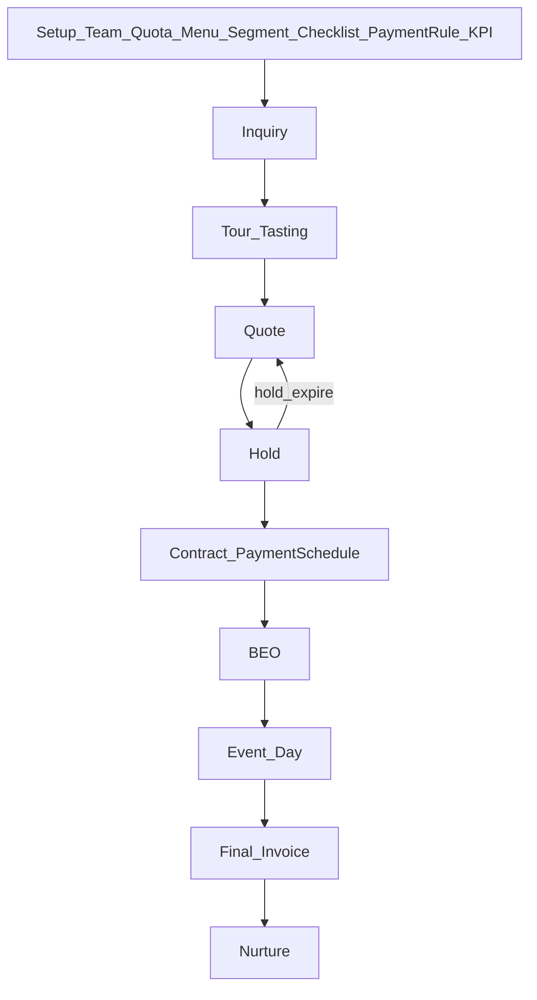

# 02 — Flow xử lý (khóa từ G1)

**Quy tắc chốt G1:**

1. Đổi stage: checklist mục **Required** phải xong.
2. Cọc/TT: theo **Payment rule config** của quy trình sale (`Required`, min %, min Amount).
3. Ký MVP: **Owner status**; sau → APPROVAL đồng ký.
4. KPI: config linh động.

Chi tiết nghiệp vụ: [g1-nghiep-vu-flow.md](g1-nghiep-vu-flow.md).
