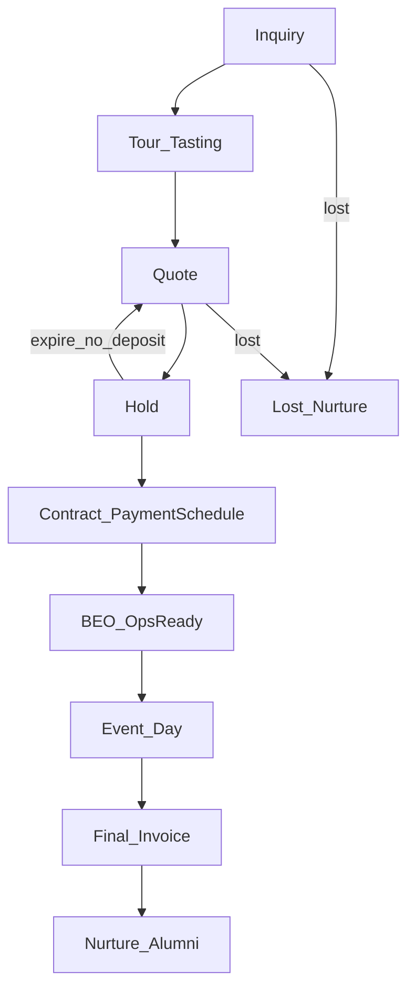

# G1 Artifact — Nghiệp vụ + Flow & chức năng (rev.2)

**Chương trình:** CRM Nhà hàng / Tiệc cưới (ART-ERP)  
**Gate:** G1 — chờ anh **Confirm**  
**Nhánh:** `AI/crm-wedding-g1-a303` · **Rev:** 2 (2026-07-23)  
**Thay đổi rev.2:** Bổ sung theo góp ý anh + phản biện **GD Marketing / GD Bán hàng / Operator nhà hàng**.

> Anh đọc → chat **`Confirm G1`** (hoặc chỉnh) → em sang G2 (forms chi tiết).

---

## 0. Tóm tắt phản biện nội bộ (3 vai)

| Vai | Kết luận chính |
|-----|----------------|
| **GD Marketing** | Pipeline đang nghiêng sales-ops; thiếu segment journey, campaign attribution, KPI CPL/CAC, nurture pre-sale |
| **GD Bán hàng** | Thiếu sale team / quota / commission / price book / stage gate checklist — CRM chưa điều khiển hành vi bán |
| **Operator** | BEO phải là **lệnh sản xuất**, không phải tóm tắt bán hàng; cọc tiến độ gắn release đặt tươi / lock D-7 |

→ Rev.2 đưa các khối này vào **phạm vi chức năng MVP** (không để Phase 2 trừ khi anh cắt).

---

## 1. Mục tiêu

- Không sót lead; phản hồi nhanh (AI hỗ trợ, AutoSend off mặc định).
- Không double-book sảnh/ngày/ca; không “treo” ngày không cọc.
- Quản được: team sale + quota + KPI; menu/package; quy trình & checklist theo segment; HĐ + lịch thanh toán; BEO ops-ready.
- Docs giao anh: Hướng dẫn / Flow / Forms / Chức năng form / Test cases.

---

## 2. Đặc trưng ngành

| Đặc trưng | Hệ quả |
|-----------|--------|
| Inventory = ngày + sảnh + ca | Calendar + soft/hard hold + concurrency lock |
| Giá mùa / peak / T7–CN | Price book + phụ thu bắt buộc trên quote |
| Chu kỳ bán dài | Pipeline + checklist + SLA từng stage |
| Nhiều stakeholder | Contact roles + segment journey |
| Cọc theo tiến độ | Payment schedule gắn release Ops |
| BEO = lệnh sản xuất | Chi tiết menu/allergen/timing/staff; kitchen ẩn giá bán |
| Đa brand/outlet | Team + campaign + attribution theo brand/outlet |

---

## 3. As-is ART (rút gọn)

Có: Lead, Opp (`EventDate`, Guests), Contract, Attendance, Activity, Contact, Campaign, Loyalty, SALE Quotation/Order, POS booking, APPROVAL/OSM/n8n.  
Thiếu UI Opp/Contract/Activity; thiếu setup team/quota/price book event; thiếu payment schedule; BEO chưa có; LLM chưa có.

**Chiến lược:** mở rộng CRM + SALE/POS/BANK/APPROVAL — không greenfield.

---

## 4. Pipeline + stage gate

| Stage | Exit criteria | Gate cứng (đề xuất) |
|-------|---------------|---------------------|
| Inquiry | Owner + segment + nguồn/campaign + next action | Không owner → không convert |
| Tour/Tasting | Show/no-show + note + deadline quote | — |
| Quote | Version + hiệu lực + package từ price book | Chiết khấu vượt quyền → Approval |
| Hold | Deadline cọc + calendar soft block | Hết hạn → auto release |
| Contract + TT | HĐ + **payment schedule** + cọc 1 đủ | Không cọc 1 → không Confirmed / hard book |
| BEO | Ops-ready checklist đủ + **cọc 2** (nếu policy) | Lock D-7; thiếu mục → chặn lock |
| Event Day | Run-of-show + extras ký on-site | — |
| Final Invoice | Quyết toán extras + thu đủ | — |
| Nurture | NPS/CSAT + loyalty/referral enroll | — |

---

## 5. Khối chức năng MVP (rev.2)

### 5.1 Setup tổ chức bán hàng (GD Sale yêu cầu)

| Chức năng | Mô tả |
|-----------|--------|
| **Sale team** | Branch/Venue → Team (Wedding/Corporate/Banquet) → Leader → AE; Primary Owner bắt buộc trên Lead/Opp |
| **Phân lead** | Round-robin + rule ưu tiên (hot / paid / sảnh trống gần ngày) |
| **Quota** | Tháng + quý: signed revenue, deposit collected (optional #event/sảnh) |
| **Commission hook** | Recognize theo **collected** (cọc/tiến độ), không chỉ chữ ký HĐ |
| **Quyền giá** | AE ≤x% / Leader ≤y% / trên nữa = Manager + lý do |

### 5.2 Items / Menu / Package / Price book

| Chức năng | Mô tả |
|-----------|--------|
| **Hall master** | Sảnh, capacity, ca, min spend |
| **Package** | Theo sảnh × bàn/pax × buổi × ngày thường/peak |
| **Menu set** | Set A/B/C + upgrade line; gắn WMS Item |
| **Items bán lẻ** | Decor, AV, MC, rượu, overtime… |
| **Peak / SC / VAT** | Hiện trên quote; cấm Excel ngoài hệ thống (policy) |
| **Quote validity + version** | 7–14 ngày; version history |

### 5.3 KPI (Sale + Marketing)

**Sale (tuần):** conversion Inquiry→Tour→Quote→Hold→Contract; AOV; cycle time; deposit on-time %; forecast hygiene (next action + close date).  

**Marketing:** CPL/CAC theo kênh-brand; MQL→SQL→Won; tour show-up; won by source; post-event NPS/CSAT; % lead có Campaign+Source.

### 5.4 Segment / phân hạng + quy trình & chăm sóc

| Segment (MVP tối thiểu) | Journey khác biệt |
|-------------------------|-------------------|
| Wedding | Tour + tasting; nurture D+n; anniversary |
| Corporate / MICE | Báo giá nhanh; PO/MST; recurring |
| Member / VIP loyalty | Ưu tiên assign; offer riêng; SLA ngắn hơn |
| Other / Referral | Tag nguồn; referral reward sau event |

- Rule phân loại: nguồn, budget, guests, member tier.  
- Playbook chăm sóc **theo segment × stage** (nội dung/FAQ/offer/SLA).  
- Lost mọi stage → lý do + nurture win-back.  
- Campaign/Source **bắt buộc** trên Lead; attribution first+last touch đến Won.

### 5.5 Checklist đầu việc từng giai đoạn

Template checklist theo **segment × stage**. Mỗi mục có cờ **`IsRequired`**.

- Mục **Required** thiếu → **không cho đổi stage** sang bước sau.
- Mục optional: cảnh báo, không chặn.
- % hoàn thành hiển thị trên Opp/Deal.

### 5.6 Hợp đồng + thanh toán theo tiến độ

| Chức năng | Mô tả |
|-----------|--------|
| Contract từ Quote | Snapshot giá/package/điều khoản |
| **Payment schedule (config)** | Định nghĩa theo **quy trình sale**: số mốc, tên mốc, `IsRequired`, min **%** và/hoặc min **Amount**, due rule (vd trước Event D-n) |
| Theo dõi thực thu | Gắn Incoming Payment; Due / Paid / Overdue |
| Gate | Milestone Required chưa Paid → chặn hành động map (Confirmed / hard book / BEO lock / PO tươi) theo config |
| Ký duyệt MVP | **Owner Status** (Sale/Ops owner ký trạng thái); Phase sau → **APPROVAL** đồng ký |
| SALE_Order | Sau Confirmed |

### 5.6b KPI linh động

- Không hard-code 1 bộ KPI cố định trên UI.
- Config: metric code, nguồn dữ liệu, công thức/filter, board/widget, role xem.
- Seed mặc định (conversion, AOV, deposit on-time, CPL…) — anh/admin bật/tắt/sửa.

### 5.7 BEO — lệnh sản xuất (Operator)

**Không chấp nhận BEO chung “menu, layout, AV”.** MVP BEO gồm nhóm:

| Nhóm | Mục bắt buộc |
|------|----------------|
| Menu/Bếp | Course × bàn/zone; suất; dietary/allergen theo ghế/tên; tasting signed; change cut-off D-7 |
| Beverage | Package, bar/ice/glassware, last call |
| Floor | Table plan, layout function, decor/vendor + load-in window |
| Timing | Setup / guest / fire time course / breakdown / room release |
| AV | Mic, screen, cue speech, power |
| Staffing | Captain, ratio waiter, chef lead, OT rule |
| Kho | Shopping list từ BEO; substitution rule |
| Thương mại Ops | Deposit status flag; portion/food cost nội bộ; **ẩn giá bán/margin khỏi Kitchen** |
| Meta | Version, Sales owner, Ops owner, lock timestamp |

**Mốc Ops:** D-30 tentative → D-14 Ops review → **D-7 LOCK + Kitchen nhận** → D-3 confirm → D-1 green/amber/red → Event Day log → D+1 close + extras → Invoice.

### 5.8 AI Sales (giữ nguyên tinh thần)

Draft reply/qualify/tour slot/draft quote từ price book/follow-up/NBA.  
Duyệt người: dưới sàn, peak hold, confidence thấp, deal lớn, AutoSend **OFF**.

### 5.9 Master & role

Hall, Package/Price book, Segment, Checklist template, Sale team/Quota, Campaign.  
Roles: Sale, Leader, Manager, Marketing, Kitchen, Banquet, Accountant, Admin, GM (override).

---

## 6. Defaults — **ĐÃ CHỐT G1** (2026-07-23)

| # | Hạng mục | Chốt |
|---|----------|------|
| 1 | Loại sự kiện MVP | Wedding + Corporate (+ VIP member path) |
| 2 | Soft hold | **48h** + SLA cọc theo config quy trình |
| 3 | **Cọc** | **Config theo quy trình sale:** `Required` Y/N; min **%** hoặc min **số tiền** (một trong hai / cả hai tùy rule) |
| 4 | Cọc → gate Ops | Rule gắn milestone (config): thiếu milestone Required → không Confirmed / không BEO lock (theo map quy trình) |
| 5 | **Checklist** | Mục **Required** = bắt buộc; thiếu → **chặn** tiến stage |
| 6 | Commission | Tạm **collected** như đề xuất — chưa đổi |
| 7 | **Ký / duyệt** | MVP: **Status Owner ký** trên chứng từ; **sau** tích hợp phân hệ **APPROVAL** đồng ký nhiều bên |
| 8 | **KPI** | **Cấu hình linh động** (định nghĩa metric/formula/board theo config, không hard-code cố định) |
| 9 | AI | Draft only, AutoSend off |
| 10 | Kênh lead | Web + nhập tay; Campaign+Source bắt buộc |
| 11 | Floor plan UI kéo-thả | Phase 2 (MVP: upload PDF) |
| 12 | Feature flag prod | Off đến G6 |

---

## 7. RACI

| Khối | Sale | Leader | Mkt | Ops | Finance | Anh |
|------|------|--------|-----|-----|---------|-----|
| Team/Quota/KPI | C | R | C | — | C | Confirm G1 |
| Price book | C | A discount | — | C F&B | A | Confirm |
| Segment journey | C | C | R | — | — | Confirm |
| Checklist stage | R | A | C | C | — | Confirm |
| Payment schedule | C | C | — | C gate | R/A | Confirm |
| BEO | C | — | — | R/A | — | Confirm |
| Go-live | — | — | — | — | — | **Lệnh G6** |

---

## 8. MVP vs Phase 2

**MVP:** §5.1–5.9 đủ; BEO ops-ready + payment schedule + team/quota/KPI + segment checklist + AI draft.  
**Phase 2:** Floor plan drag-drop; Zalo OA sâu; AutoSend rộng; seating nâng cao; ROAS đầy đủ nếu chưa có cost campaign.

---

## 9. Câu hỏi đóng còn lại (nếu anh Confirm kèm trả lời càng tốt)

1. Cọc 2 trước D-7: **% bao nhiêu** (hay số cố định theo sảnh)?  
2. Stage gate checklist: **chặn cứng** nhảy stage hay chỉ cảnh báo? (Default: chặn Hold/Contract/BEO)  
3. Commission: chắc chắn **collected** chứ không signed?  
4. BEO owner ký Ops-ready: **Banquet Manager** hay Chef+Banquet đồng ký?  
5. KPI board 90 ngày ưu tiên: **quota+deposit** hay thêm **CPL/CAC** ngay MVP?

---

## 10. Trạng thái G1

**CONFIRMED** 2026-07-23 — xem [../gates/G1.md](../gates/G1.md).  
Tiếp theo: **G2** danh sách forms + chức năng.
