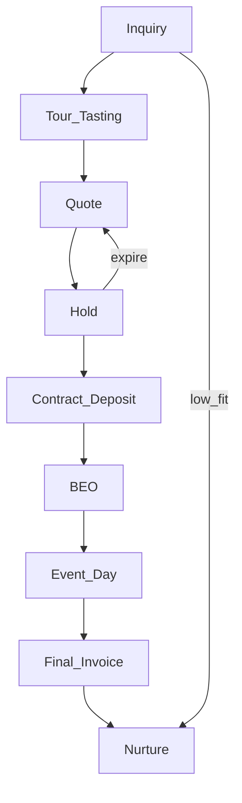

# G1 Artifact — Tổng hợp nghiệp vụ + Đề xuất flow & chức năng

**Chương trình:** CRM Nhà hàng / Tiệc cưới (ART-ERP)  
**Gate:** G1 — chờ anh **Confirm**  
**PM:** Cloud agent · Nhánh: `AI/crm-wedding-g1-a303`  
**Ngày:** 2026-07-23

> Anh đọc xong → chat **`Confirm G1`** (hoặc ghi chỉnh) → em mới sang G2 (danh sách forms).

---

## 1. Bối cảnh & mục tiêu

Xây module CRM phục vụ **nhà hàng / sảnh tiệc cưới & sự kiện**, gắn vào ART-ERP sẵn có — không greenfield.

**Mục tiêu kinh doanh:**

- Không sót lead; phản hồi nhanh (AI hỗ trợ).
- Không double-book sảnh/ngày/khung giờ.
- Theo dõi đủ: báo giá → giữ chỗ → cọc → HĐ → BEO → ngày tiệc → quyết toán → nuôi dưỡng.
- Tài liệu giao anh chỉ: Hướng dẫn dùng / Flow / Forms / Chức năng form / Test cases.

---

## 2. Đặc trưng ngành (vì CRM generic không đủ)

| Đặc trưng | Hệ quả hệ thống |
|-----------|-----------------|
| Inventory = **ngày + sảnh + ca (trưa/tối)** | Calendar + soft/hard hold + chống trùng |
| Giá theo mùa / T7–CN / lễ | Price book theo slot, không chỉ catalog món |
| Chu kỳ bán dài (30–180 ngày) | Pipeline dài + follow-up D+n |
| Nhiều stakeholder | Roles: cô dâu/chú rể/bố mẹ/planner |
| Cọc theo đợt | Milestone payment, không one-shot |
| BEO handoff Sales → Bếp/Banquet | Convert sang ops doc, kitchen ẩn giá |
| Peak date khan hiếm | SLA phản hồi; AI first-touch; duyệt hold peak |

---

## 3. As-is ART-ERP (đã khảo sát)

| Có sẵn | Ghi chú |
|--------|---------|
| `CRM_Lead`, `CRM_Opportunity` (`EventDate`, `NumberOfGuests`), `CRM_Contract`, `CRM_Attendance`, `CRM_Activity`, Contact | BE CRUD đủ |
| FE: lead, campaign, attendance-booking, BP/customer, loyalty… | **Thiếu** UI Opportunity / Contract / Activity |
| `SALE_Order` đã có `IDOpportunity`, `IDContract`, `NumberOfGuests` | Nối SO sau HĐ/cọc |
| `SALE_Quotation` + Detail | Dùng cho báo giá có dòng menu/gói |
| POS `pos-booking` dùng `CRM_Attendance` | Booking ngày tiệc |
| APPROVAL / OSM / SyncJob / n8n / AutomationWebhook | Duyệt, nhắc, automation |
| LLM product | **Chưa có** — AI Sales làm package riêng có guardrail |

**Kết luận kỹ thuật đề xuất:** mở rộng `pages/CRM` + nối SALE/POS/BANK — không tạo module EVENT tách.

---

## 4. Pipeline đề xuất (9 stage)

| Stage | Mục đích | Điều kiện ra |
|-------|----------|--------------|
| Inquiry | Lead vào (web/Zalo/FB/hotline/nhập tay) | Đã phản hồi + thu ngày/pax/budget tối thiểu |
| Tour / Tasting | Tham quan / nếm thử | Có lịch + kết quả |
| Quote | Báo giá chính thức | Đã gửi + đang cân nhắc |
| Hold | Soft giữ ngày+sảnh | Slot blocked trong X giờ |
| Contract + Deposit | Ký HĐ + cọc min% | Hard book calendar |
| BEO | Chốt vận hành | Ops approve (+ khách nếu cần) |
| Event Day | Thực hiện tiệc | Close event + phát sinh |
| Final Invoice | Quyết toán | Thu đủ + HĐ |
| Nurture | NPS / referral / upsell | Tag post-event |

---

## 5. Đề xuất chức năng theo khối (chưa chi tiết field — field ở G2)

### 5.1 Bán hàng & pipeline

- Lead: CRUD, assign, convert → Opportunity, nguồn/campaign.
- Opportunity: stage machine, EventDate, guests/bàn, sảnh quan tâm, lose reason.
- Activity: call / Zalo / meeting gắn Lead/Opp.
- Tour/Tasting booking: lịch, reminder, kết quả.

### 5.2 Báo giá & giữ chỗ

- Quotation (qua SALE_Quotation): dòng menu/gói/phụ thu peak, PDF, version, approve nếu dưới sàn / vượt ngưỡng.
- Hall calendar: trống/hold/booked theo ngày + ca.
- Soft/Hard Hold: conflict check, auto-expire, concurrent lock.

### 5.3 Hợp đồng & tiền

- Contract từ Quote; lịch cọc; gắn Incoming Payment.
- Sinh SALE_Order (`IDContract` / `IDOpportunity` / guests).
- Attendance gắn Opp/Contract (PartyDate, pax).

### 5.4 Vận hành ngày tiệc

- BEO: menu, layout, timeline, AV; Ops approve; lock trước D-n; kitchen sheet **ẩn giá**.
- Event day: pax thực tế, extras → phụ lục / final invoice.
- Phase 2 đề xuất: floor plan kéo-thả (không MVP trừ khi anh bắt buộc).

### 5.5 AI Sales Assistant (có kiểm soát)

| AI làm (đề xuất) | Bắt buộc người duyệt |
|------------------|----------------------|
| Draft reply &lt;60s | Quote dưới giá sàn |
| Qualify / score | Peak date hold |
| Đề xuất slot tour | Confidence thấp |
| Draft quote từ price book | Deal lớn / chiết khấu cao |
| Follow-up D+2/5/10 | Contract & payment terms |
| Next-best-action | AutoSend mặc định **OFF** |

### 5.6 Master & cấu hình

- Hall (sảnh, capacity, branch).
- Package / price book (peak rules).
- Roles: Sale, Sale Manager, Kitchen, Banquet, Accountant, Admin.

---

## 6. Defaults đề xuất (anh Confirm hoặc chỉnh)

| # | Hạng mục | Default PM |
|---|----------|------------|
| 1 | Phạm vi sự kiện MVP | Cưới **+** công ty/sinh nhật (cùng pipeline, khác type) |
| 2 | Soft hold hết hạn | **48 giờ** |
| 3 | Cọc min → Hard book | **30%** giá trị HĐ |
| 4 | AI lần đầu | **Chỉ draft** — Sale gửi tay (`AutoSend=off`) |
| 5 | Kênh lead MVP | **Web form + nhập tay** (Zalo phase sau) |
| 6 | Pilot go-live | **1 chi nhánh** |
| 7 | Floor plan kéo-thả | **Phase 2** |
| 8 | Lock BEO trước event | **D-7** |
| 9 | Peak hold | Cần **Sale Manager** duyệt |
| 10 | Production | Feature flag off đến G6 |

---

## 7. RACI nhanh

| Khối | Sale | AI | Ops | Finance | Anh (sponsor) |
|------|------|----|-----|---------|---------------|
| Lead / Inquiry | R | R draft | — | — | Confirm scope G1 |
| Quote / Hold | R | C draft | C | A (dưới sàn) | Confirm G1–G2 |
| Contract | R | — | — | A | UAT G5 |
| BEO | C | — | R/A | — | Confirm forms G2 |
| Go-live flag | — | — | — | — | **Lệnh G6** |

---

## 8. KPI đề xuất (theo dõi sau go-live)

- First reply median (AI on) &lt; 60s  
- Inquiry → Tour → Quote → Contract conversion  
- Zero confirmed double-book  
- Hold expire rate  
- % deal AI-drafted vs human-sent  
- Deposit on-time %

---

## 9. Phạm vi MVP vs Phase 2

**MVP (sau G1–G5):** Pipeline FE Opp/Contract/Activity · Quote+Hold · Contract+cọc+SO · BEO cơ bản · AI draft+guardrail · docs 5 loại.

**Phase 2:** Floor plan UI · Zalo OA sâu · AutoSend rộng · Guest seating nâng cao · Loyalty post-event sâu.

---

## 10. Xin Confirm G1

Anh vui lòng trả lời một trong các dạng:

1. **`Confirm G1`** — chấp nhận flow + chức năng + defaults mục 6.  
2. **`Confirm G1` + chỉnh:** … (liệt kê thay đổi).  
3. **`Reject G1`** + lý do — em sửa artifact rồi xin lại.

**Sau Confirm G1** em sẽ:

- Ghi `gates/G1.md`  
- Soạn G2: danh sách forms + chức năng từng form + draft test cases  
- Xin họp/confirm G2  

**Em không** làm prototype hay code BE cho đến khi có Confirm G1 + G2 + chốt prototype G3.
