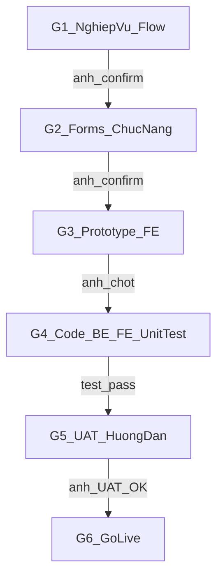
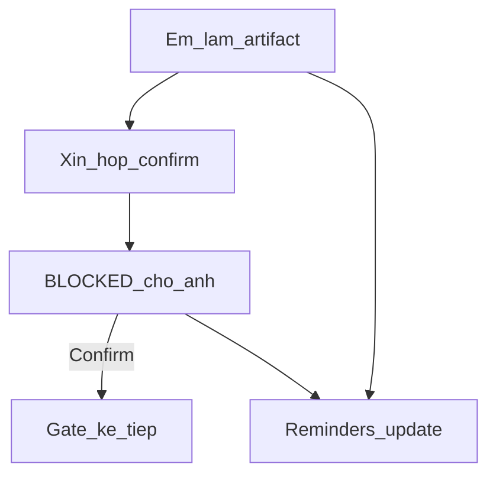
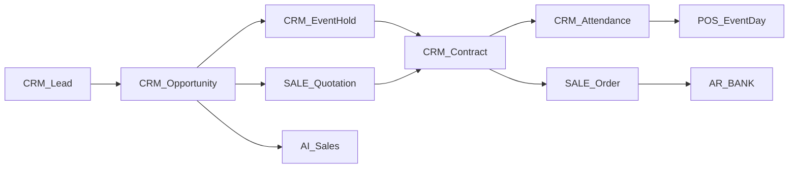

# Module CRM Nhà hàng / Tiệc cưới — Plan

**Canonical:** [`.cursor/plans/CRM/plan.md`](plan.md)  
**Queue:** [task-queue.md](task-queue.md) · **DOCS:** [docs/](docs/) · **Biên bản:** [gates/](gates/)

**Trạng thái:** `WAITING_SPONSOR_CONFIRM_G2` (G1 **CONFIRMED**)  
**G1:** [docs/g1-nghiep-vu-flow.md](docs/g1-nghiep-vu-flow.md) · [gates/G1.md](gates/G1.md)  
**G2 artifacts:** [docs/03-danh-sach-forms.md](docs/03-danh-sach-forms.md) · [docs/04-chuc-nang-trong-form.md](docs/04-chuc-nang-trong-form.md) · [docs/05-test-cases.md](docs/05-test-cases.md)  
→ Anh chat **`Confirm G2`**.

---

# 0. Cách PM làm việc với anh (bắt buộc)



| Bước | Em làm | Em xin anh | Không làm gì tiếp nếu |
|------|--------|------------|------------------------|
| **G1** | Tổng hợp nghiệp vụ ngành + as-is ART → **đề xuất flow + chức năng** | **Họp / chat confirm** | Chưa confirm → không khóa form, không prototype |
| **G2** | Phân tích → **danh sách forms + chức năng trong từng form** (+ draft test cases) | **Họp / chat confirm** | Chưa confirm → không prototype |
| **G3** | **Prototype FE** (UI thật / mock data, chưa gắn BE đầy đủ) | **Demo → anh chốt UI/flow màn hình** | Chưa chốt → không code BE/FE production |
| **G4** | **Code BE → code FE** → **unit/API test theo test cases** đã chốt | Báo tiến độ (Reminders); không cần họp trừ blocker | Test fail → sửa, không nhảy UAT |
| **G5** | **UAT demo** end-to-end trên staging | **Anh UAT confirm** → em viết **Hướng dẫn sử dụng** (+ đủ bộ docs) | UAT chưa OK → không go-live |
| **G6** | Checklist regression + rollback | **Lệnh anh** bật flag prod | Không tự bật |

**Nguyên tắc cứng:**

1. Em **chủ động soạn** tài liệu/demo trước mỗi gate, rồi **xin họp / xin confirm** — không tự “default bỏ qua” các cổng G1–G3, G5–G6.
2. Giữa hai gate: em làm việc (phân tích, prototype, code, test); anh theo dõi Reminders.
3. Confirm có thể qua **họp 30–45’** hoặc **chat “Confirm G#”** sau khi anh đã xem artifact.
4. Reminders = đèn báo tiến độ; **không** thay confirm của anh.

**Artifact anh nhận theo gate:**

| Gate | Em gửi trước họp |
|------|------------------|
| G1 | Tóm tắt nghiệp vụ + sơ đồ flow + danh sách chức năng đề xuất |
| G2 | Bảng forms + chức năng/field/nút từng form (docs draft 03+04) + test cases draft |
| G3 | Link staging prototype / recording + checklist màn hình |
| G4 | Báo cáo test (pass/fail theo TC) |
| G5 | Script UAT + **Hướng dẫn sử dụng** sau khi UAT OK |
| G6 | Checklist go-live |

---

# Phần A — Kỹ thuật (làm sau khi G1–G3 đã chốt)

## A1. Hướng thiết kế (đề xuất — chốt ở G1)

| Hạng mục | Đề xuất PM (chờ anh confirm G1) |
|----------|----------------------------------|
| Chiến lược | Không greenfield — mở rộng CRM ART + SALE / POS / BANK / APPROVAL / OSM / n8n |
| Pipeline | Inquiry → Tour/Tasting → Quote → Hold → Contract+Deposit → BEO → Event Day → Final Invoice → Nurture |
| Quotation | `SALE_Quotation` + Detail gắn Opportunity |
| Booking | Nâng `CRM_Attendance` + Hall/Hold |
| AI Sales | Draft + qualify + follow-up; human approve dưới sàn / peak / confidence thấp |
| Production | Additive + feature flag; G6 mới bật prod |

**As-is:** Lead / Opportunity (EventDate, Guests) / Contract / Attendance / Contact đã có BE; FE thiếu Opp/Contract/Activity UI; chưa LLM product.

## A2. Đặc trưng ngành (input G1)

- Inventory = ngày + sảnh + khung giờ → hold, chống double-book  
- Price book mùa / T7-CN / lễ  
- Chu kỳ bán dài, nhiều stakeholder, cọc milestone, BEO handoff  
- Peak → SLA phản hồi nhanh (AI hỗ trợ)

## A3. Autopilot giữa các gate (không vượt confirm)



| Phase sau confirm | Việc em chạy |
|-------------------|--------------|
| Sau G1 | Soạn G2 forms + chức năng |
| Sau G2 | Build prototype FE (G3) |
| Sau G3 | Package build: BE + FE + unit test (G4) theo forms đã chốt |
| Sau G4 pass | Chuẩn bị UAT (G5) |
| Sau G5 | Hướng dẫn sử dụng + docs đủ 5 loại; chờ G6 |

**Packages kỹ thuật (G4) — map form đã chốt:**

| Pkg | Nội dung | Flag |
|-----|----------|------|
| A | Opp/Contract/Activity FE + convert + stage | `CRM.EventPipeline` |
| B | SALE Quotation + Hall + Hold | `CRM.HallHold` |
| C | Contract + cọc + Attendance FK + SO | `CRM.ContractDeposit` |
| D | BEO + kitchen handoff | `CRM.BEO` |
| AI | Assistant + guardrail | `CRM.AI.Assist` / `AutoSend` |
| E | n8n / KPI | — |

Thứ tự G4: A → B → C → D ∥ AI → E; unit test theo TC đã chốt ở G2 (cập nhật nếu G3 đổi UI).

## A4. Production safety

| Loại | Cách làm |
|------|----------|
| P0 UI/prototype | Feature branch |
| P1 hold / SO từ Contract | Flag off mặc định |
| P2 schema | Additive only |
| P3 AI auto-send | `CRM.AI.AutoSend=false` đến khi anh bật |

## A5. Domain mục tiêu (đề xuất — chốt G1/G2)



## A6. Docs giao anh (hoàn thiện ở G5)

1. `01-huong-dan-su-dung.md` — **viết sau UAT OK**  
2. `02-flow-xu-ly.md` — chốt từ G1  
3. `03-danh-sach-forms.md` — chốt từ G2  
4. `04-chuc-nang-trong-form.md` — chốt từ G2  
5. `05-test-cases.md` — draft G2, khóa trước G4, dùng UAT G5  

## A7. Test P0 (đề xuất — chốt trong G2)

TC-CRM-01 double-book · TC-CRM-02 hold/deposit overdue · TC-CRM-03 đổi menu sau HĐ · TC-CRM-04 AI dưới sàn · TC-CRM-05 concurrent hold.

---

# Phần B — Chi tiết từng cổng confirm

## B1. G1 — Nghiệp vụ + Flow + Chức năng

| | |
|--|--|
| **Em chuẩn bị** | Tóm tắt đặc trưng ngành; as-is ART; đề xuất pipeline 9 stage; RACI; AI làm gì / người duyệt gì; KPI |
| **Em xin** | Họp / confirm: “Anh chốt flow & phạm vi chức năng G1?” |
| **Anh confirm** | Go / chỉnh (bỏ stage, thêm type tiệc, AI mức nào…) |
| **Output** | `gates/G1.md` + cập nhật flow vào docs draft `02-flow` |
| **Câu hỏi gợi ý** | Chỉ cưới hay + công ty? Hold 48h? Cọc 30%? AI draft-only hay auto FAQ? Floor plan MVP hay Phase 2? |

## B2. G2 — Danh sách forms + chức năng trong form

| | |
|--|--|
| **Em chuẩn bị** | Bảng mọi form (Lead, Opp, Tour, Quote, Hold, Contract, BEO, Attendance, AI inbox, Hall config…): field, nút, quyền role, validation |
| **Em xin** | Họp / confirm từng nhóm form hoặc cả bộ |
| **Anh confirm** | Go / cắt form Phase 2 / đổi tên field |
| **Output** | `gates/G2.md` + draft `03` + `04` + `05-test-cases` |
| **Không** | Bắt đầu prototype khi chưa Confirm G2 |

## B3. G3 — Prototype FE → Demo → Chốt

| | |
|--|--|
| **Em làm** | Prototype Angular/Ionic theo forms đã chốt: navigation, list/detail, happy path mock |
| **Em xin** | Slot demo (hoặc video + “Confirm G3”) |
| **Anh chốt** | UI/flow màn hình OK để code thật |
| **Output** | `gates/G3.md` + danh sách chỉnh UI (nếu có) trước khi G4 |
| **Không** | Code BE production / gắn API thật quy mô lớn trước Confirm G3 |

## B4. G4 — Code BE + FE + Unit test

| | |
|--|--|
| **Em làm** | BE (`ART-DMS`) + FE theo prototype; feature flag; unit/API test map `05-test-cases` |
| **Anh** | Xem Reminders `[CRM][pkg-*]`; họp chỉ khi blocker cần quyết định |
| **DoD** | TC P0 pass trên staging; báo cáo test gửi anh trước khi xin G5 |
| **Output** | `gates/G4.md` (test summary) |

## B5. G5 — UAT demo → Hướng dẫn sử dụng

| | |
|--|--|
| **Em xin** | UAT session theo script (Sale / Manager / Banquet / Accountant tùy scope) |
| **Anh** | UAT: pass / list lỗi |
| **Em sau UAT OK** | Viết **Hướng dẫn sử dụng**; hoàn thiện 5 docs |
| **Output** | `gates/G5.md` + `docs/01`…`05` |

## B6. G6 — Go-live

| | |
|--|--|
| **Em show** | Regression + rollback = tắt flag |
| **Anh** | Lệnh: Bật / Hoãn / Pilot + giờ |
| **Output** | `gates/G6.md` |

## B7. Biên bản gate

```
Gate: G#
Date:
Sponsor decision: Confirm / Adjust / Reject
Feedback:
Artifacts:
Next gate:
Blockers:
```

## B8. Em mang tới mỗi cuộc họp confirm

1. Agenda 5 dòng + thời lượng  
2. Artifact đã gửi trước (≥1 ngày nếu họp)  
3. Câu hỏi đóng cần anh trả lời trong họp  
4. Reminders đã cập nhật trạng thái “chờ Confirm G#”

---

# Phần C — Reminders (mirror)

**List:** `ART-CRM Wedding` · Prefix `[CRM][G#]` / `[CRM][pkg-*]` / `[CRM][ORCH]`

| Reminder | Khi complete |
|----------|--------------|
| `[CRM][G1] Confirm nghiệp vụ + flow` | Anh Confirm G1 |
| `[CRM][G2] Confirm forms + chức năng` | Anh Confirm G2 |
| `[CRM][G3] Demo prototype — chốt UI` | Anh chốt G3 |
| `[CRM][G4] Build BE/FE + unit test` | Test P0 pass |
| `[CRM][G5] UAT + hướng dẫn sử dụng` | UAT OK + docs xong |
| `[CRM][G6] Go-live flag` | Anh lệnh bật |
| `[CRM][pkg-a]` … | Package DONE trong G4 |

**Sync:** ORCH cập nhật khi artifact xong / chờ confirm / DONE. Anh **không cần tick**. Em **không** sang gate sau khi reminder gate chưa complete vì thiếu Confirm anh.

---

# Việc tiếp theo ngay

1. G1 **CONFIRMED** — [gates/G1.md](gates/G1.md)  
2. **Xin Confirm G2** — forms + chức năng: [docs/03](docs/03-danh-sach-forms.md), [docs/04](docs/04-chuc-nang-trong-form.md)  
3. Sau Confirm G2 → Prototype FE (G3)
