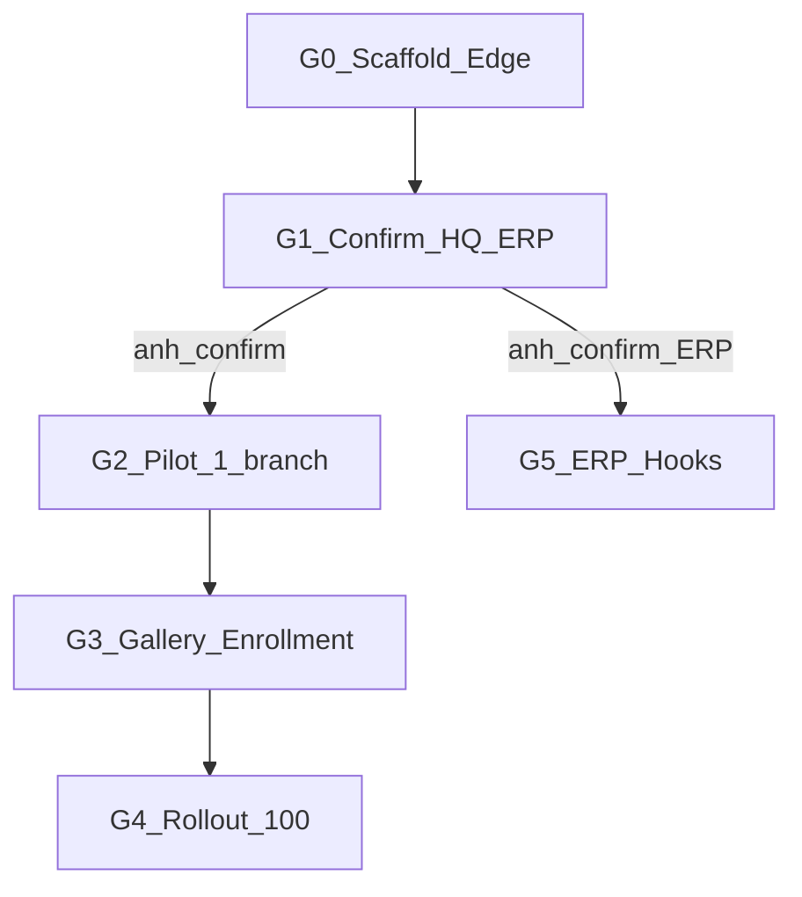

# Module Edge Face AI — Plan

**Path:** [`.cursor/plans/EDGE-FACE/plan.md`](plan.md)  
**Code:** [`ART-Edge-Face/`](../../../ART-Edge-Face/)  
**Brief gốc:** Technical Brief anh gửi (Edge processing + resource constraints).

**Trạng thái:** `WAITING_G1` — scaffold Edge đã sẵn; em **xin anh confirm** contract HQ/ERP trước khi đụng ART-ERP-BE.

---

## 0. Baseline đã lấy từ Brief (G0 — không đổi trừ anh Adjust)

| Hạng mục | Quyết định |
|----------|------------|
| Mô hình | Edge infer + HQ log sync |
| Host Edge | Windows Service headless trên POS sẵn có |
| Inference | OpenVINO → Intel iGPU |
| Detect / Recog | YuNet (hoặc DBFace) / MobileFaceNet (hoặc ArcFace-MobileNetV2) |
| Match | FAISS-CPU IndexFlatIP hoặc numpy; gallery RAM 100–500 |
| Offline | SQLite local + sync bù |
| Cameras | 1–3 sub-stream + ROI |
| RAM / CPU | ≤300MB / ≤10% CPU |
| Confidence | ≥ 0.75 |

---

## 1. Em xin anh confirm (G1) — HARD

1. **HQ receiver:** NAS custom API hay endpoint mới trên ART-ERP-BE?  
2. **Nghiệp vụ event:** chỉ audit log / chấm công / CRM VIP walk-in / cả ba?  
3. **Enrollment:** ai tạo embedding (HQ app vs Edge tool)?  
4. **Gallery scope:** theo chi nhánh hay toàn chuỗi?  
5. **Pilot branch** nào trước (cam RTSP + POS mẫu)?

Agenda họp G1 (15–20’): xem `ART-Edge-Face/docs/03-hq-api-contract.md` + demo `--dry-check-config`.

Biên bản: `gates/G1.md` sau họp.

---

## 2. Deliverables đã có (G0)

- Package `ART-Edge-Face` (pipeline, SQLite, HQ client, Windows Service)
- `config.example.json`, install script, deploy checklist
- Unit tests (config, ROI, gallery match, offline queue)
- Docs architecture / flow / API contract draft

## 3. Chưa làm (đúng vì chờ G1)

- Không modify ART-ERP-BE/FE (submodule trống + chưa confirm contract)
- Không commit binary models
- Không claim đã đo RAM/CPU trên i3 thật — cần pilot G2

---

## 4. Definition of Done MVP Edge

- Service chạy ngầm trên POS pilot, không mở GUI
- Match staff/VIP local, event về HQ (online + offline catch-up)
- RAM/CPU trong ngưỡng brief (đo ở G2)
- ERP hooks chỉ sau G1 + G5 lệnh anh
