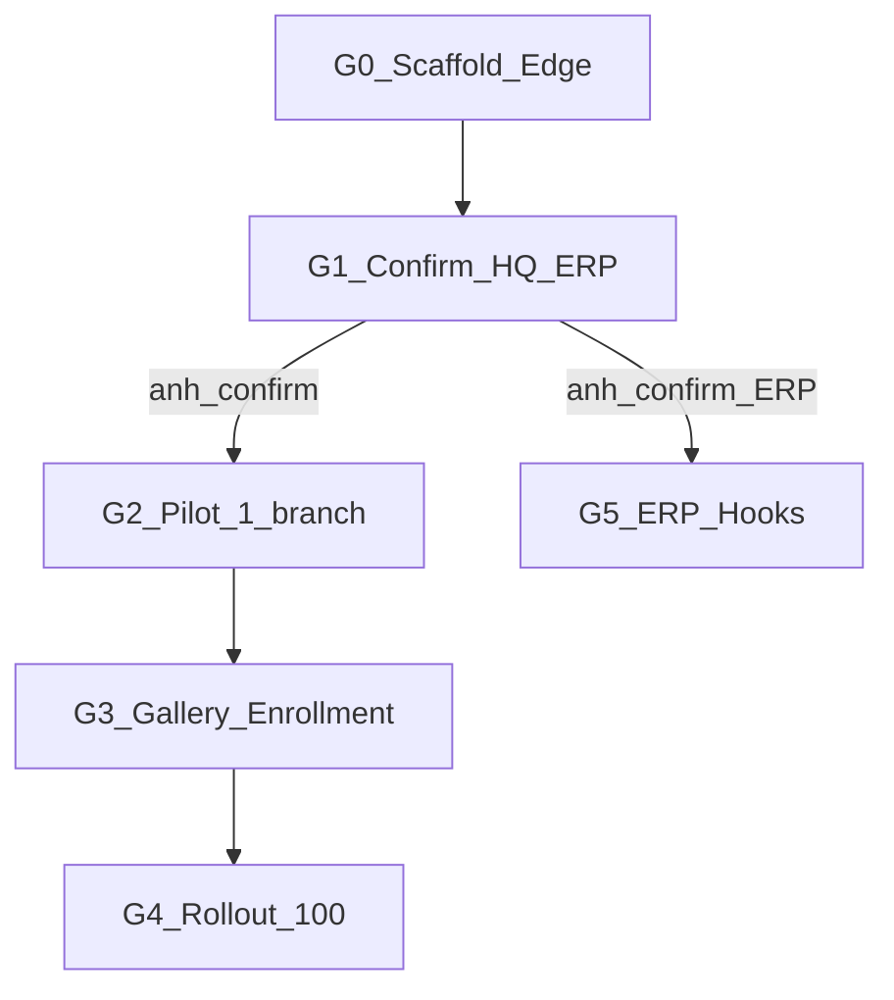

# Module Edge Face AI — Plan

**Path:** [`.cursor/plans/EDGE-FACE/plan.md`](plan.md)  
**Code:** [`ART-Edge-Face/`](../../../ART-Edge-Face/)  
**Brief gốc:** Technical Brief anh gửi (Edge processing + resource constraints).

**Trạng thái:** `WAITING_G2_PILOT` — contract BE/ERP đã chốt; chưa có branch pilot / RTSP mẫu để đo thực địa.

---

## 0. Baseline đã lấy từ Brief (G0 — không đổi trừ anh Adjust)

| Hạng mục | Quyết định |
|----------|------------|
| Mô hình | Edge infer + HQ log sync |
| Host Edge | Windows Service headless trên POS sẵn có |
| Inference | OpenVINO → Intel iGPU |
| Detect / Recog | YuNet (hoặc DBFace) / MobileFaceNet (hoặc ArcFace-MobileNetV2) |
| Match | FAISS-CPU IndexFlatIP hoặc numpy; gallery RAM 100–500 |
| Offline | SQLite local + sync bù |
| Cameras | 1–3 sub-stream + ROI |
| RAM / CPU | ≤300MB / ≤10% CPU |
| Confidence | ≥ 0.75 |

---

## 1. G1 — Đã confirm

1. **BE API** là receiver
2. Scope nghiệp vụ:
   - **Điểm danh / chấm công**
   - **Đếm người theo khu vực / heatmap**
   - **Nhận diện khách lạ / quen / VIP**
3. **Vector sinh trắc học lưu tại BE**, clone xuống Edge để match local
4. Scope **toàn chuỗi**, có **RBAC theo chi nhánh**
5. Nếu **không nhận diện được**, Edge vẫn phải log để **manual mapping trên ERP theo branch**

Tài liệu chốt hiện tại:

- `ART-Edge-Face/docs/03-hq-api-contract.md`
- `ART-Edge-Face/docs/05-be-openapi.yaml`
- `ART-Edge-Face/docs/06-be-openapi-summary.md`

---

## 2. Deliverables đã có (G0)

- Package `ART-Edge-Face` (pipeline, SQLite, HQ client, Windows Service)
- `config.example.json`, install script, deploy checklist
- Unit tests (config, ROI, gallery match, offline queue)
- Docs architecture / flow / API contract + OpenAPI YAML

## 3. Chưa làm / đang chờ

- Chưa modify ART-ERP-BE/FE vì submodule hiện trống trong workspace này
- Không commit binary models
- Không claim đã đo RAM/CPU trên i3 thật — cần pilot G2
- Chưa có pilot branch / RTSP mẫu

---

## 4. Definition of Done MVP Edge

- Service chạy ngầm trên POS pilot, không mở GUI
- Match staff/VIP local, event về HQ (online + offline catch-up)
- RAM/CPU trong ngưỡng brief (đo ở G2)
- Unknown faces phải vào queue manual mapping theo branch
- ERP hooks / BE implementation thật cần workspace có submodule BE đầy đủ hoặc repo BE riêng
