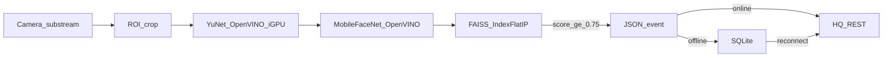

# Edge Face — Architecture

## Mô hình Edge-Cloud Hybrid

| Tầng | Trách nhiệm | Không làm |
|------|-------------|-----------|
| **Edge (POS)** | Ingest sub-stream, detect, embed, match local, queue/sync event | Không ghi NVR, không GUI, không train model |
| **HQ NAS / API** | Nhận event, cung cấp gallery theo `branch_id`, lưu log | Không chạy inference realtime cho 100+ chi nhánh |
| **ERP** | Consume API HQ (attendance / VIP / CRM hooks) | Không pull RTSP từ chi nhánh |

## Pipeline Edge

## Ràng buộc POS

- Windows 11 Service (`ARTEdgeFace`), headless
- Intel OpenVINO → iGPU; CPU giữ &lt; 10%
- Gallery 100–500 vector trong RAM
- Max 3 camera trọng điểm; ROI bắt buộc cấu hình

## Cấu hình chính (`config.json`)

- `cameras[].rtsp_url` — **sub-stream only**
- `cameras[].roi` — chuẩn hóa 0..1
- `confidence_threshold` — sàn 0.75 (code clamp)
- `hq.api_base_url` + webhook paths
- `models.device` — `GPU` (fallback CPU nếu không có iGPU driver)
